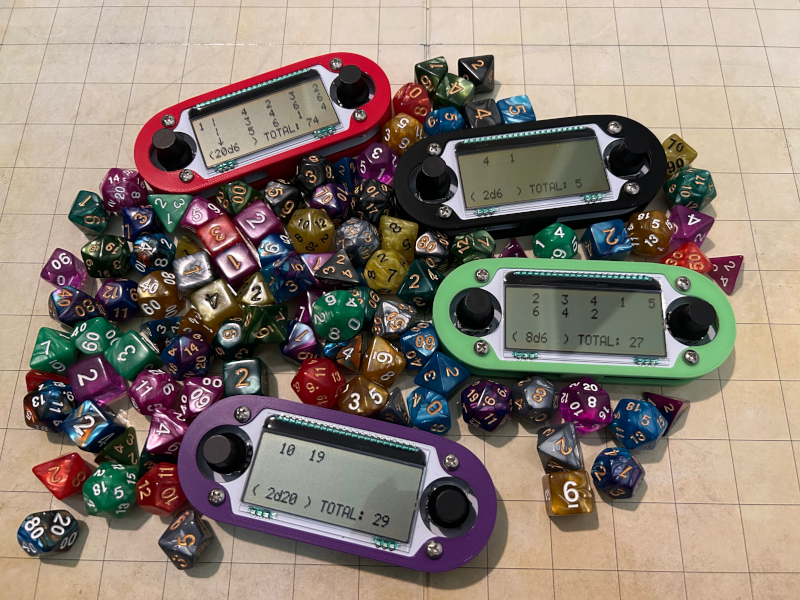

# TTRPG-9000

The TTRPG-9000 is an open-hardware and open-source handheld electronic dice 
rolling computer for table top RPGs. It allows the user to select NdM to roll
and shows the result of each individual roll as well as the total. A psuedo 
random number generator is seeded/updated via both the clock and user 
interactions with the board making for good randomness in the output. It runs 
off of 2 1.5V CR2302 batteries and has a very good battery life (tested to 40+ 
hours and going). 

## Where to Buy

If you want a unit, but do not have the expertise to fab/solder the PCB, 
program the software and 3D print the case you can buy on 
(Etsy)[https://www.etsy.com/listing/1776769027/hand-held-electronic-dice]
from my store. 
