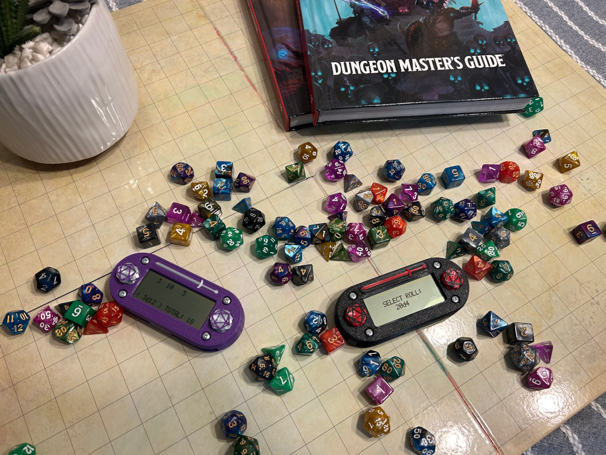
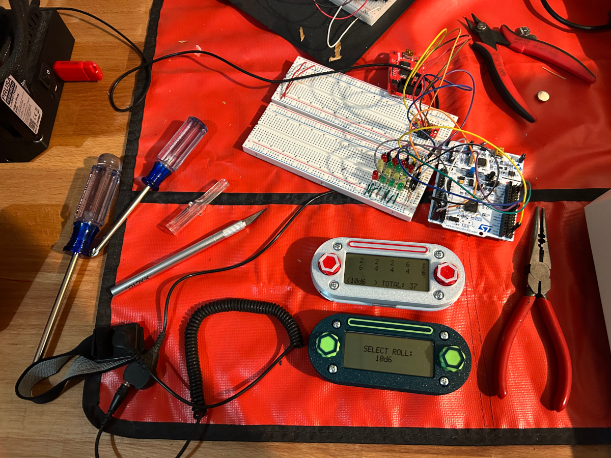

# TTRPG-9000




The TTRPG-9000 is an open-hardware and open-source handheld electronic dicerolling computer for table top RPGs. It allows the user to select NdM to roll and shows the result of each individual roll as well as the total. Dice available are d2, d4, d6, d8, d10, d12, d20 and d100. A psuedo random number generator is seeded/updated via both the clock and user interactions with the board making for good randomness in the output. It runs off of a single 1.5V CR2302 battery and has a very good battery life (tested to 80+ hours and going). Due to requests from a lot of Shadowrun players there is a special Shadowrun software build option that adds a summary mode for hits and glitches as well as a boot mode (turn on the power while holding down an encoder) that makes it work just like the original version.

## Build and installation

To build and install, you will need a Linux computer with gcc-avr, binutils-avr avr-libc and avrdude installed. (I'm sure you can do it on Windows too, but you are on your own)

Prefer not to install the toolchain? You can build the whole thing in a Podman container instead — see [code/PODMAN.md](code/PODMAN.md).

### Build (Standard)

```bash
$ cd code
$ make
```

### Build (Shadowrun)

```bash
$ cd code
$ SHADOWRUN=1 make
```

### Build documentation

The API documentation is generated with doxygen:

```bash
$ cd code
$ make docs
```

The result is written to `code/docs/html/index.html`.

### Software installation

To install you will need an AVR programmer (make sure it is set to 3v3 programming mode, usually with a jumper). Attach to the 6 pin AVR programming port by soldering on a header or using a Pogo adapter. The run

```bash
$ make flash
```

## Buy on Etsy

Support me and my work by buying a pre-fabricated unit on Etsy!

[Standard Edition](https://www.etsy.com/listing/1792348298/artificer-dice-electronic-dice-for-dd)

[Shadowrun Edition](https://www.etsy.com/listing/4419946141/ttrpg-9000-shadowrun-edition-electronic)
